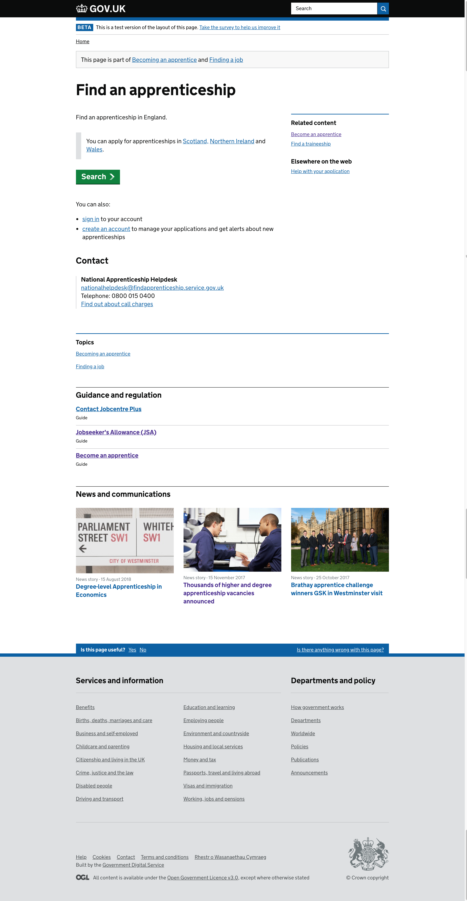

# Navigation links in B variant of ContentPagesNav

### Screenshots


### Configuration

#### Overview
The configuration of which kinds of links appear for which kinds of content is governed by
[config/taxonomy_navigation_links_out.yml](../config/taxonomy_navigation_links_out.yml)

This file dictates which kinds of content are shown at three hierarchical levels: document type, subgroup
 and supergroup. It allows rules to be created that can cover all three levels.
Perhaps counterintuitively, document_type is at the top of the hierarchy with supergroup at the bottom. 
This means a document_type rule overrides a subgroup rule, which in turn overrides a supergroup rule

This is desirable as it means we can have fine grained control over what links we show for a particular document_type
 or subgroup while being able to fall back for general supergroup level rules for the large number of content items
 that will match a supergroup. For example, for an `open_consultation` we can show links to `policy_and_engagement`
  and `decisions`

#### Structure

Each entry in all three levels of the hierarchy must have a key which content items will be matched to if they
have that value for their document_type, content_purpose_subgroup or content_purpose_supergroup. The value for this
key must have the following entries
 - `title`: the name of the part of the subgroup or supergroup we want to show, e.g. `services`
  or `news`
 - `type`: the type of the part of the subgroup or supergroup we want to show e.g. `content_purpose_supergroup`
  or `content_purpose_subgroup`
 - `supergroup`: The supergroup of the part of the subgroup or supergroup we want to show, regardless of whether or
  not what we're showing is itself a supergroup e.g. `services` or `policy_and_engagement`
  
#### Showing no links
If you don't want to show any related taxonomy links for a particular document type, this can be defined in the config as follows:

```
document_type:
     fatality_notice: []
 ```
  
#### Example
```
   document_type:
      fatality_notice: []
      ...
      open_consultation:
      - title: policy_and_engagement
        type: content_purpose_supergroup
        supergroup: policy_and_engagement
      - title: decisions
        type: content_purpose_subgroup
        supergroup: transparency
  ```
  
  
### Fetching
This is likely to change in the future so this is only a high level overview.

When displaying a content item, the app will consult the configuration file to determine what (if any) supergroups
should be displayed for the content item, which will be scoped to include any subgroups if present. 

Rummager is queried for either the most popular or most recent content for that supergroup. If any content items
are returned, a relevant navigation section with those items will be rendered.
